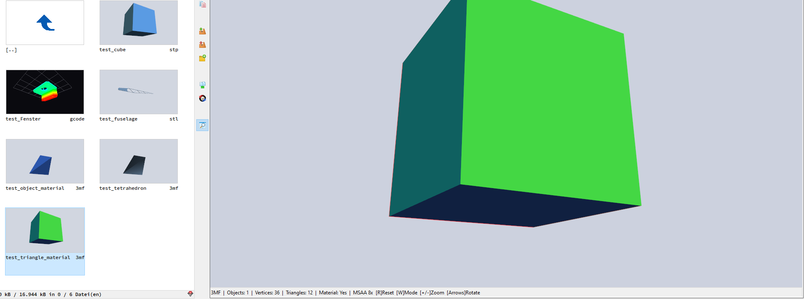

# 3MF Viewer – Total Commander Lister Plugin

Interaktiver OpenGL-Viewer für 3D-Modelle und G-Code im Total Commander Lister.  
Basiert auf **lib3mf 2.5.0** (3MF Consortium) und Direct Win32/WGL – kein LCL-Framework.



---

## Unterstützte Formate

| Erweiterung | Format | Lade-Bibliothek |
|---|---|---|
| `.3mf` | 3D Manufacturing Format | lib3mf 2.5.0 |
| `.stl` | Stereolithography (Binary + ASCII) | Eingebaut |
| `.stp`, `.step` | STEP (eingeschränktes BREP) | Eingebaut |
| `.gcode`, `.gco`, `.nc`, `.ngc` | 3D-Druck-G-Code | Eingebaut |

SVG und DXF werden nicht unterstützt.

### lib3mf – unterstützte 3MF-Inhalte

lib3mf implementiert die **3MF Core Specification** sowie folgende Extensions:

- **Mesh-Objekte** – Dreiecksnetze mit Vertices und Normalen
- **Components** – Instanzen / Referenzen auf andere Objekte
- **Build-Items** – Transformationen und Anordnung im Bauraum
- **Materials & Properties Extension** – Farben, Texturen, Multi-Properties
- **Beam Lattice Extension** – Gitterstrukturen
- **Slice Extension** – 2D-Schichtdaten
- **Production Extension** – UUIDs, Pfad-basierte Struktur
- **Secure Content Extension** – Verschlüsselung

> **Hinweis:** Der aktuelle Viewer liest alle Mesh-Objekte (MeshObjects).
> Build-Item-Transformationen und Component-Referenzen werden noch nicht
> angewendet – alle Geometrien erscheinen im Modell-Koordinatensystem.

Der STEP-Importer unterstützt keine NURBS- oder B-Spline-Flächen.

---

## Steuerung

| Eingabe | Aktion |
|---|---|
| Linke Maustaste + Ziehen | Modell drehen |
| Rechte Maustaste + Ziehen | Pan (verschieben) |
| Mausrad | Zoom |
| Doppelklick | Ansicht zurücksetzen |
| `R` / `F5` | Ansicht zurücksetzen |
| `W` | Modus: Solid → Solid+Drahtgitter → Drahtgitter |
| Pfeiltasten | 5°-Rotation |
| `+` / `-` | Zoom |

TC Dark-Mode wird automatisch erkannt (`lcp_darkmode`-Flag).

Im G-Code-Modus stehen zusätzlich Layer-, Support-, Travel- und
Linienbreitenoptionen im rechten Bedienfeld zur Verfügung. `G92`-Resets für
Position und Extruder werden berücksichtigt.

---

## Voraussetzungen

- **Total Commander 64-bit** für `3mfviewer.wlx64`, oder **32-bit** für `3mfviewer.wlx`
- **Windows 10/11** (x86 oder x64, passend zu Total Commander)
- **OpenGL 1.5+** (auf jedem Windows-System mit aktuellem Grafiktreiber vorhanden)
- Für `3mfviewer.wlx64`: **`lib3mf.dll`** muss im selben Verzeichnis liegen
- Für `3mfviewer.wlx`: **`lib3mf_32bit.dll\lib3mf.dll`** muss relativ zum Plugin liegen

Dateipfade werden für 3MF, STL, STEP und G-Code intern über Unicode-Windows-APIs
geöffnet. Die Thumbnail-Schnittstelle von WLX selbst übergibt ihren Dateinamen
lediglich als ANSI-Zeichenkette.

---

## Build

### Voraussetzungen

- **Lazarus 3.x** mit **FPC 3.2.x**, Toolchain `x86_64-win64`
  Download: https://www.lazarus-ide.org/

> Kein LCL-Paket erforderlich. Das Plugin verwendet nur FPC RTL + Windows-API.

### Lazarus IDE

1. `File → Open Project` → `3mfviewer.lpi`
2. Build-Modus **Release 64** oder **Release 32**
3. `Run → Build` (`Shift+F9`)
4. Ausgabe: `3mfviewer.wlx64`

### Kommandozeile

```bat
lazbuild 3mfviewer.lpi --build-mode="Release 64"
lazbuild 3mfviewer.lpi --build-mode="Release 32"
```

---

## Installation in Total Commander

1. Architekturpassende Dateien bereitstellen:
   - 64 Bit: `3mfviewer.wlx64` und `lib3mf.dll` im selben Verzeichnis
   - 32 Bit: `3mfviewer.wlx` sowie `lib3mf_32bit.dll\lib3mf.dll`

2. In TC: `Konfiguration → Optionen → Plugins → Lister Plugins → Hinzufügen`

3. TC speichert den Detect-String für 3MF, STL, STEP und G-Code automatisch.

> **Beim Build:** TC muss geschlossen sein, da die geladene DLL gesperrt wird
> (Windows Error 5 = Access Denied).

---

## Projektstruktur

```
3mfviewer/
├── 3mfviewer.lpi          Lazarus-Projektdatei
├── 3mfviewer.lpr          Library-Einstiegspunkt (Exports)
├── plugin_main.pas        WLX-Exports + Fenster-Lifecycle
├── viewer_form.pas        Win32-Fenster, WGL/OpenGL, Splash, Steuerung
├── mesh_data.pas          3MF/STL/STEP-Laden, Normalen, Bounding Sphere
├── gcodeparser.pas        G-Code-Parser mit Layer- und Feature-Erkennung
├── listplug.pas           WLX SDK Header v2.12
└── lib3mf/
    └── Unit_Lib3MF.pas    Pascal-Bindings (auto-generiert, ACT 1.8.1)
```

---

## Lizenzen

### Dieses Plugin

Frei verwendbar ohne Einschränkungen.

### lib3mf – BSD 2-Clause License

`lib3mf.dll` und `Unit_Lib3MF.pas` unterliegen der **BSD 2-Clause License**:

```
Copyright (C) 2024 3MF Consortium

Redistribution and use in source and binary forms, with or without
modification, are permitted provided that the following conditions are met:

1. Redistributions of source code must retain the above copyright notice,
   this list of conditions and the following disclaimer.

2. Redistributions in binary form must reproduce the above copyright notice,
   this list of conditions and the following disclaimer in the documentation
   and/or other materials provided with the distribution.

THIS SOFTWARE IS PROVIDED BY THE COPYRIGHT HOLDERS AND CONTRIBUTORS "AS IS"
AND ANY EXPRESS OR IMPLIED WARRANTIES, INCLUDING, BUT NOT LIMITED TO, THE
IMPLIED WARRANTIES OF MERCHANTABILITY AND FITNESS FOR A PARTICULAR PURPOSE
ARE DISCLAIMED. IN NO EVENT SHALL THE COPYRIGHT HOLDER OR CONTRIBUTORS BE
LIABLE FOR ANY DIRECT, INDIRECT, INCIDENTAL, SPECIAL, EXEMPLARY, OR
CONSEQUENTIAL DAMAGES (INCLUDING, BUT NOT LIMITED TO, PROCUREMENT OF
SUBSTITUTE GOODS OR SERVICES; LOSS OF USE, DATA, OR PROFITS; OR BUSINESS
INTERRUPTION) HOWEVER CAUSED AND ON ANY THEORY OF LIABILITY, WHETHER IN
CONTRACT, STRICT LIABILITY, OR TORT (INCLUDING NEGLIGENCE OR OTHERWISE)
ARISING IN ANY WAY OUT OF THE USE OF THIS SOFTWARE, EVEN IF ADVISED OF THE
POSSIBILITY OF SUCH DAMAGE.
```

Quelle: https://github.com/3MFConsortium/lib3mf  
Die Pascal-Bindings wurden generiert mit dem Automatic Component Toolkit (ACT) v1.8.1.
